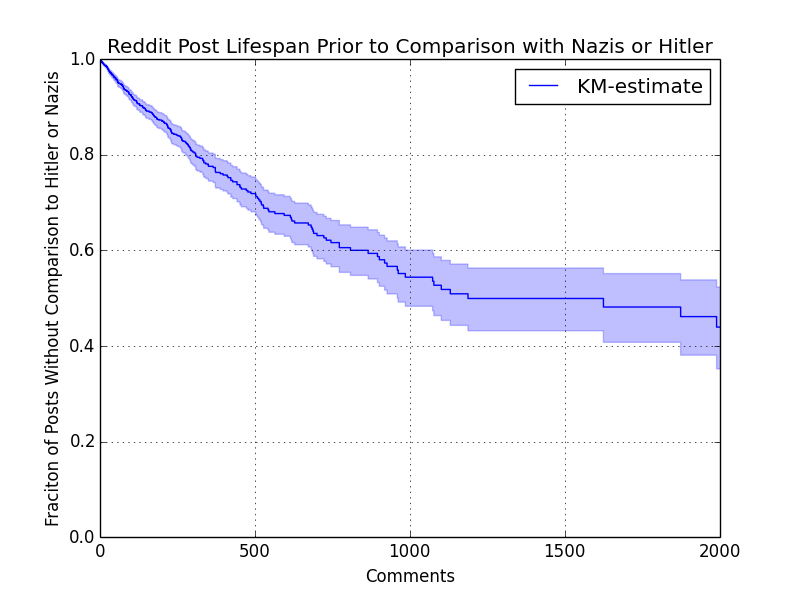

# Godwin's Law on Reddit: Survival Analysis

### Text of my Reddit post

**Title**: [OC] [MiC] Analyzing Godwin's Law on Reddit: as comment threads get larger, the chances of at least one reference to Nazi Germany go up. ([IMAGE LINK](https://i.imgur.com/oA7SLQX.png)) (POST LINK)

**[OC].** 

Here are some more visualizations from my analysis. Error bars and shaded intervals represent 95% confidence intervals. For the kernel density plots, the shaded intervals represent the 25th to 75th percentile data.

- [Black and white version](https://i.imgur.com/NZW2S6w.png) of the survival curve

- [Percentage passing, binned](https://i.imgur.com/VXbQWZU.png) by number of comments in thread.

- For the posts that fail, [how long does it take to fail](https://i.imgur.com/y8rg90i.png)? (Note: this is only a partial figure, broken down by subreddit. For the full figure, check the [GitHub project page](https://github.com/edridgedsouza/GODWIN))

- Which subreddits have the highest [percentage of failing posts](https://i.imgur.com/M9JwMR0.png)?

I was inspired by the [previous post](https://www.reddit.com/r/dataisbeautiful/comments/2s0e7i/visualizing_godwins_law_on_reddit_oc/) by /u/Lukas_Halim that used survival analysis to model Godwin's Law on Reddit. I [forked](https://github.com/edridgedsouza/GODWIN) his original [repository](https://github.com/lukashalim/GODWIN) and extended his scraper; rather than simply taking the top 5000 posts, I used the PRAW and PushShift APIs to scrape ~250 subreddits (including /r/all and /r/popular) for:

- top 100 posts of the month

- top 100 posts of the year

- top 100 posts of all time

- top 100 most commented posts

For the purpose of this analysis, a "failure event" refers to when a thread contains a comment with one of the (aptly named) "[failure words](https://github.com/edridgedsouza/GODWIN/blob/master/godwin/Scraper.py#L42)" associated with Nazi Germany. As with /u/Lukas_Halim's original analysis, I defined my "time to event" as the number of comments in a thread before a failure event occurred; for threads without a failure event (i.e. "passing" threads), this was simply the total number of comments. In both cases, this attempts to quantify "survival time" using number of comments rather than actual time. To understand the "cumulative hazard", I found [this link](https://stats.stackexchange.com/a/60250) helpful; to overly simplify, think of it as the number of failure events you expect to experience after X amount of time.

For full code and more in-depth explanations of these figures, check out the [Jupyter notebook](https://github.com/edridgedsouza/GODWIN/blob/master/Visualization.ipynb) on my GitHub. I aim to release the full scraped database if possible, at which point people are free under the MIT license to fork my repo and analyze the data by themselves. This scraper produced over 80k comment threads with almost 72mil analyzed comments; if you plan to run the scraper yourself, make sure you have a few days to spare! The rate limiter adds up. I only did the top 100 posts in each time frame but someone else may have the time to gather even more.

**A DISCLAIMER**: This analysis is meant to be a quantitative look at online rhetoric and is in no way an endorsement of such rhetoric. Comments discussing WWII on /r/history or analyzing modern-day fascist movements on /r/PoliticalDiscussion are, of course, vastly different from a comment on /r/funny casually comparing moderators to the Nazi regime. The latter trivializes the atrocities of the Nazis, while the former examples are vital in ensuring we understand our history and choose not to repeat it. When looking at any of the plots in this analysis, please understand this context before drawing conclusions about any particular subreddits. I have tried to handle this contentious topic with the appropriate sensitivity and objectivity but am open to any suggestions on how I may improve in this regard.

### @lukashalim's original analysis of Godwin's Law on Reddit [original readme text]

Godwin's Law states that, "As an online discussion grows longer, the probability of a comparison involving Nazis or Hitler approaches 1." Mike Godwin explained, "Although deliberately framed as if it were a law of nature or of mathematics, its purpose has always been rhetorical and pedagogical: I wanted folks who glibly compared someone else to Hitler or to Nazis to think a bit harder about the Holocaust." [Source](http://jewcy.com/jewish-arts-and-culture/i_seem_be_verb_18_years_godwins_law#sthash.kLqPt6EY.dpuf) 

Despite Godwin's admonition regarding the rhetorical and pedogogical purpose of the law, I thought it would be an interesting exercise to treat Godwin's law as if it were a law of nature, and subject it to some statistical scrutiny. If an online discussion includes 100 or 200 or 500 posts, how likely is a Hitler or Nazi comparison? 

Since Reddit has a [convenient API](http://www.reddit.com/dev/api) for scraping, I decided to use Reddit as a data source. Python's [lifelines package](http://lifelines.readthedocs.org/en/latest/Intro%20to%20lifelines.html#estimating-the-survival-function-using-kaplan-meier) implements a number of statistical techniques related to "survival analysis." Survival analysis gets is so named because the techniques were created to study time until a death, but it is useful in understanding time until other events. In this case, we want to know how long a discussion with "survive" until a Hitler or Nazi comparison.

I collected over 10,000 posts and analyzed them with LifeLines. This is the resulting Kaplan-Meier survival function:

So, for example, as an Reddit discussion approaches 2000 posts, the probability of a comparison involving Nazis or Hitler is approaches 60%.

However, it should be noted that not every comment mentioning Hitler or the Nazis is making a comparison, and that on the other hand it is possible to make a Hitler or Nazi comparison without using the words "Nazi" or "Hitler" in the post, and when, for example, someone on a Selfie thread randomly posts a picture of Hitler, it's not clear to me how it should be categorized. But to try to be as accurate as possible, I skimmed through all ~1500 comments containing "Hitler" or "Nazi" and tried to change the flag for comments that mentioned Hitler or Nazi but weren't comparisons. For example, this post is a discussion of [Hans-Ulrich Rudel](http://www.reddit.com/r/todayilearned/comments/2r07pm/til_hansulrich_rudel_is_the_only_person_to_be/cnbinj5), a Nazi, and many of the comments mention Hitler or Nazi, but the commentors are not generally comparing anyone or anything to Nazis. The process was tedious and I'm sure I made mistakes - it would have been better to have fed the data into Mechanical Turk and have the Turkers determine which mentions were comparisons. If you'd like to see the data, it's available on [my dropbox](https://www.dropbox.com/s/zs5pgihii86tpx2/Godwin.db?dl=0).

Reddit posts feature many comments about grammar nazis and feminazis. I considered these to be implicit comparisons to Nazis.

## Running the Code
You will need python, with [praw](https://praw.readthedocs.org/en/v2.1.19/), [lifelines](http://lifelines.readthedocs.org/en/latest/Quickstart.html), and [pandas](http://lifelines.readthedocs.org/en/latest/Quickstart.html).
First run the "Create Database.py," then "Collect_Posts.py" and finally "Analyze Posts.py"
Also, you will be able to data more quickly by editing the [praw.ini file](http://praw.readthedocs.org/en/latest/pages/configuration_files.html?highlight=ini)

**Update to this section from Edridge:** To perform this analysis with the updated code, run Scraping.ipynb and Visualization.ipynb.
They can be run at the same time, but if the database locks due to too many open connections, you may need to restart the kernel.
You will need to create a `config.json` file in the project directory containing the fields "client_id" and "client_secret",
which you obtain by registering an app/script on Reddit.